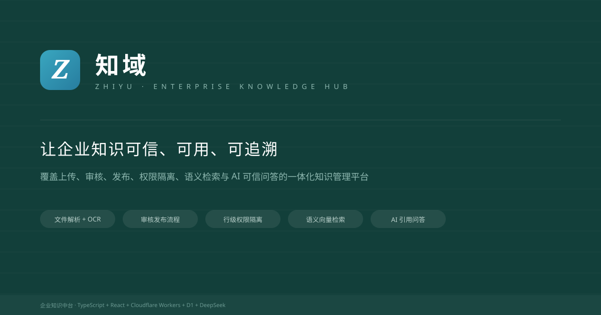
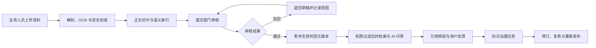
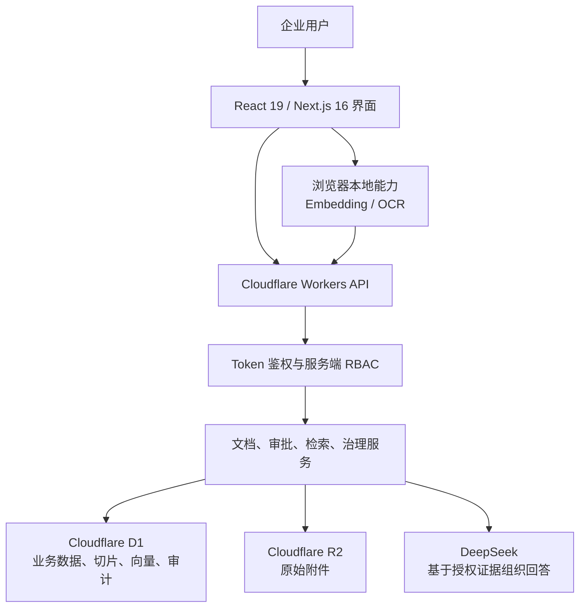

# 知域 · 企业知识中台

> 面向企业知识生产、审核发布、权限治理、语义检索与可信 AI 问答的一体化知识管理平台。

[](https://www.typescriptlang.org/)
[](https://react.dev/)
[](https://workers.cloudflare.com/)
[](https://nodejs.org/)

[在线访问](https://zhiyu-knowledge-hub-public.yangshan-ai-flow.workers.dev) · [权限说明](docs/PERMISSIONS.md) · [发布流程](docs/PUBLISHING-FLOW.md) · [部署指南](docs/DEPLOYMENT.md) · [接口契约](docs/API-CONTRACTS.md)

公开地址会为每个浏览器创建独立的外部普通员工账号，可上传和维护本人资料、提交部门审核、收藏知识并保存独立的 AI 会话历史；审批、删除他人资料、权限配置和全局治理仍按企业角色权限控制。公开演示环境同时提供普通员工、部门管理员、超级管理员三套预置演示身份，可一键切换后查看对应角色的完整功能。



## 项目简介

知域围绕企业内部知识的完整生命周期建设，不把知识库简单理解为“上传文件 + 关键词搜索”。系统从业务部门创建资料开始，覆盖文件解析、内容安全检查、部门审批、版本发布、权限隔离、语义检索、AI 引用问答、质量反馈、到期复核和审计追踪。

平台遵循“谁产生、谁维护”的治理原则：业务部门对内容真实性和时效性负责，知识管理员负责全局目录、权限、过期内容、涉密风险和运营质量。所有权限判断均在服务端执行，前端菜单与按钮只承担交互展示，不作为安全边界。

## 核心能力

### 知识生产与发布

- 支持 TXT、Markdown、PDF、DOCX、XLSX、PPTX 与图片资料上传。
- 自动提取正文、分段切片并建立关键词与语义索引。
- 图片和扫描版 PDF 可在浏览器侧执行中英文 OCR。
- 上传资料自动关联当前用户、所属部门、目录、负责人和可见范围。
- 固定状态流转：草稿 → 待部门审核 → 已归档生效 → 已过期作废。
- 审核、驳回、发布、作废、恢复与彻底删除均保留操作记录。
- 文档更新生成新版本；首个版本只显示为当前版本，不伪造历史版本。

### 组织、权限与数据隔离

- 超级管理员、部门管理员、普通员工三级角色体系。
- 用户—部门、用户—角色、文档—标签、文档—可见范围采用独立关联关系。
- 部门管理员只能治理本部门知识，员工只能维护本人创建的内容。
- 支持部门可见、跨部门共享、指定用户/用户组授权和敏感级别控制。
- 文档列表、详情、附件下载、编辑、审批和导出均执行服务端行级权限校验。
- 支持账号申请、审批、禁用、离职回收与知识负责人移交。

### 检索与可信 AI 问答

- 关键词检索与中文向量语义检索结合，支持相近表达召回。
- 支持常见同音字和输入错误纠正，并在界面上提示识别后的查询意图。
- 检索前先执行账号、部门、共享范围、敏感级别与文档状态过滤。
- DeepSeek 只基于当前用户有权访问的已发布证据生成回答。
- 每个回答携带文档名称、版本、所属部门和原文摘要，可回到来源核验。
- 对寒暄、身份询问、退出等非知识意图单独处理，避免无意义引用。
- 支持多轮上下文、会话历史、办理清单、收藏、反馈与引用追溯。
- 无可靠依据时明确拒答，不用模型常识替代企业制度。

### 知识治理与运营

- 支持重复内容、过期文档、孤儿文档、解析失败和索引失败治理。
- 支持待办分配、责任人处理、修订后复核和治理闭环。
- “没解决”反馈可进入知识治理任务，并关联原问题、引用和目标文档。
- 支持搜索无结果词、热门知识、问题解决率和知识健康度统计。
- 关键操作写入审计日志，覆盖操作者、部门、对象、动作、原因与时间。
- 支持全量导出、数据备份和恢复说明。

## 业务流程



## 技术架构



| 层级 | 技术与职责 |
| --- | --- |
| 前端 | React 19、Next.js 16、TypeScript、响应式界面与无障碍交互 |
| 边缘服务 | Cloudflare Workers、vinext、统一 API 响应与异常处理 |
| 数据访问 | Drizzle ORM、Cloudflare D1、事务与参数化查询 |
| 文件存储 | Cloudflare R2，保存原始附件并通过权限接口下载 |
| AI 生成 | DeepSeek OpenAI-compatible API，完成证据约束下的答案组织 |
| 语义检索 | `Xenova/paraphrase-multilingual-MiniLM-L12-v2`，384 维中文向量 |
| OCR | Tesseract.js，本地处理中英文图片和扫描文档 |
| 文件解析 | PDF.js、Mammoth、JSZip 及 Office Open XML 解析 |
| 质量保障 | ESLint、Node Test、数据库迁移与完整业务流集成测试 |

## 权限模型

| 能力 | 超级管理员 | 部门管理员 | 普通员工 |
| --- | --- | --- | --- |
| 查看知识 | 全平台 | 本部门全部及授权内容 | 本部门已发布、本人草稿及跨部门共享内容 |
| 创建知识 | 任意部门 | 本部门 | 本部门 |
| 编辑知识 | 全平台 | 本部门 | 仅本人创建的内容 |
| 审核发布 | 全平台 | 本部门 | 无 |
| 配置共享 | 全平台 | 本部门单篇文档 | 无 |
| 作废与删除 | 作废、恢复、彻底删除 | 本部门作废 | 无 |
| 用户与部门 | 全平台管理 | 本部门成员授权 | 无 |
| 数据导出 | 全平台 | 本部门 | 按授权下载单篇附件 |

更完整的权责规则参见 [docs/PERMISSIONS.md](docs/PERMISSIONS.md)。

## 数据模型

核心文档表包含 `dept_id`、创建人、更新人、负责人、软删除标记、创建时间与更新时间。主要关联关系包括：

- 用户—部门、用户—角色、用户—用户组；
- 文档—标签、文档—可见主体、文档—附件；
- 文档—版本、文档—切片、文档—审批记录；
- 会话—消息—引用—用户反馈；
- 治理任务—来源问题—目标文档—处理记录。

完整建表结构和初始化数据见 [docs/SCHEMA.sql](docs/SCHEMA.sql) 与 [docs/INITIAL-DATA.sql](docs/INITIAL-DATA.sql)。

## 目录结构

```text
app/                 页面与 API 路由
db/                  Drizzle 数据库连接与 Schema
lib/                 鉴权、权限、解析、检索、RAG 与治理逻辑
drizzle/             D1 数据库迁移
docs/                权限、接口、流程、建表与部署文档
tests/               业务规则、数据库迁移和端到端流程测试
public/              品牌与公开静态资源
worker/              Cloudflare Worker 入口
```

## 本地运行

### 环境要求

- Node.js `>= 22.13.0`
- npm

### 安装与启动

```bash
git clone https://github.com/seaninggit/zhiyu-enterprise-kb.git
cd zhiyu-enterprise-kb
npm install
cp .env.example .env.local
npm run dev
```

本地开发地址以终端输出为准。

### AI 配置

```dotenv
AI_PROVIDER=deepseek
AI_BASE_URL=https://api.deepseek.com
AI_CHAT_MODEL=deepseek-v4-flash
DEEPSEEK_API_KEY=
```

`DEEPSEEK_API_KEY` 只用于生成基于检索证据的回答，必须作为运行环境 Secret 保存，不得提交到仓库。未配置密钥时，权限过滤、关键词检索、向量检索、引用和审计仍可使用。

当前默认的中文向量模型和 OCR 在浏览器本地运行，不需要额外的 Embedding 或 OCR 云服务密钥。首次使用语义检索时会下载模型，后续由浏览器缓存复用。

## 常用命令

```bash
npm run dev          # 启动本地开发环境
npm run lint         # 静态代码检查
npm run build        # 构建 Cloudflare Workers 运行包
npm test             # 构建并执行完整测试集
npm run db:generate  # 根据 Schema 生成 Drizzle 迁移
```

## 测试覆盖

测试集覆盖以下关键路径：

- 文档上传、解析、安全检查、切片和索引；
- 草稿提交、部门审核、发布快照和版本更新；
- 三级角色、部门隔离、用户组 ACL 与附件下载权限；
- 关键词检索、语义检索、同音纠错和无依据拒答；
- 多轮会话、引用、反馈、治理任务和修订闭环；
- 数据库外键、迁移完整性和关键字段约束。

提交代码前建议执行：

```bash
npm run lint
npm test
```

## 安全设计

- 所有业务接口统一执行登录校验，公开健康检查除外。
- 服务端根据角色、部门、文档创建人与 ACL 自动拼接访问范围。
- Drizzle 参数化查询降低 SQL 注入风险，入参同时执行结构与枚举校验。
- API 使用统一响应结构、全局异常处理、限流和审计埋点。
- 密钥仅由部署平台 Secret 注入，仓库不保存 Token、密码或固定 IP。
- 原始附件下载前再次校验文档权限，不直接暴露存储对象地址。
- 已发布内容使用版本快照，草稿修改不会污染当前检索结果。
- AI 只能接收经过权限过滤的知识切片，并且必须返回可核验引用。

## 部署

生产环境运行于 Cloudflare Workers/Sites：

- D1 保存组织、文档、版本、切片、向量、会话和审计数据；
- R2 保存原始附件；
- 环境变量和密钥由部署平台管理；
- 数据库迁移随版本发布执行。

详细环境划分、发布检查、备份与恢复方法参见 [docs/DEPLOYMENT.md](docs/DEPLOYMENT.md)。

## 相关文档

- [接口入参与返回结构](docs/API-CONTRACTS.md)
- [权限与数据隔离规则](docs/PERMISSIONS.md)
- [文档发布审核流程](docs/PUBLISHING-FLOW.md)
- [完整建表 SQL](docs/SCHEMA.sql)
- [初始化部门与角色数据](docs/INITIAL-DATA.sql)
- [生产部署说明](docs/DEPLOYMENT.md)

## License

本项目当前未声明开源许可证。未经授权，不得将代码用于商业分发。
