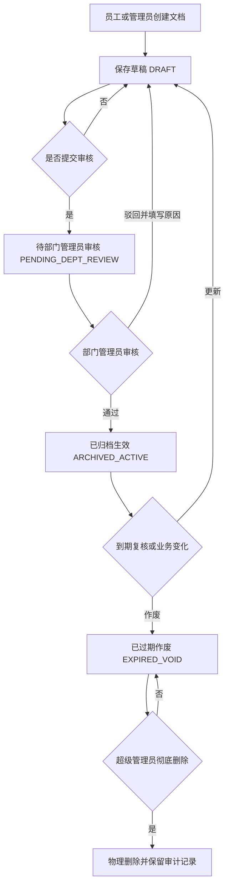

# 文档发布审核流程

```mermaid
flowchart TD
  A["员工或管理员创建文档"] --> B["保存草稿 DRAFT"]
  B --> C{"是否提交审核"}
  C -- 否 --> B
  C -- 是 --> D["待部门管理员审核 PENDING_DEPT_REVIEW"]
  D --> E{"部门管理员审核"}
  E -- 驳回并填写原因 --> B
  E -- 通过 --> F["已归档生效 ARCHIVED_ACTIVE"]
  F --> G{"到期复核或业务变化"}
  G -- 更新 --> B
  G -- 作废 --> H["已过期作废 EXPIRED_VOID"]
  H --> I{"超级管理员彻底删除"}
  I -- 否 --> H
  I -- 是 --> J["物理删除并保留审计记录"]
```

所有状态变更同时写入审批记录与审计日志。文档修改会生成新版本并回到草稿状态。

